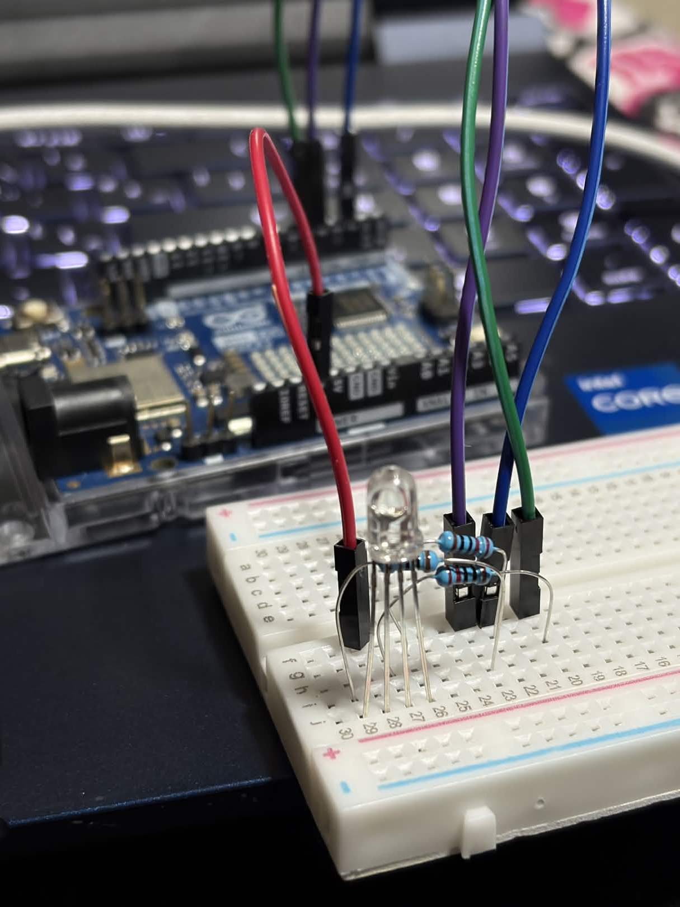

# grupo-03

## integrantes

* Antonella Aguilar
* Tomás Catrileo
* Angel Sabogal

## descripción del proyecto
Empezamos el proyecto explorando la biblioteca de aprendizaje de Adafruit IO, encontramos un tutorial en [Adafruit IO](https://learn.adafruit.com/adafruit-io-basics-color) explicando la posibilidad de enviarle una señal desde Adafruit al Arduino, de forma que se puede lograr cambiar los colores RGB de manera remota, sin cables y hasta desde otro dispositivo electrónico.

Dicho esto, unimos las conexiones del RGB al protoboard y del protoboard al Arduino: Lo primero sería conectar las 4 patas del LED RGB al protoboard, después poner 3 resistencia 220Ω, estas deben estar así:
* **R** - La luz roja o luz red es la de izquierda inicial; esta tiene que ir acompañada de una resistencia de 220Ω conectada a R y a su vez conectada al pin 4 del Arduino.
* **GND** - La segunda pata (asumiendo la izquierda R) es la de a tierra, debe ir conectada directo al Arduino en el pin 3V.
* **G** - La luz verde o luz green es la siguiente después de la GND, esta tiene que ir con una resistencia de 220 Ω y a su vez conectada al pin 5 del Arduino.
* **B** - La luz azul o luz blue es la siguiente después de la G, esta tiene que ir con una resistencia de 220 Ω y a su vez conectada al pin 2 del Arduino.

Debe quedar así:



## materiales usados en solemne-01

- 1x Arduino UNO R4 WiFi
- 1x LED RGB
- 1x Protoboard
- 3x Resistencias 220Ω
- 4x Cables dupont (m-m)

## código usado con Adafruit IO

### código para enviar

```cpp
// rellenar
```

### código para recibir

```cpp
// rellenar
```

## imágenes


## investigaciones individuales

rellenar en el mismo orden que los integrantes del grupo

[persona-01.md](./persona-01.md)
[persona-02.md](./persona-02.md)
[persona-03.md](./persona-03.md)

## bibliografía

Adafruit. (s. f.). Adafruit IO. https://io.adafruit.com/

Surbyte. (2017). Arduino Forum. https://forum.arduino.cc/t/solucionado-ayuda-monitor-serial-con-caracteres-ilegibles/473044/5

MK Electrónica. (s. f.). Aprende a utilizar la plataforma Adafruit IO para tus dispositivos IoT. https://mkelectronica.com/aprende-a-utilizar-la-plataforma-adafruit-io-para-tus-dispositivos-iot-parte-1/

Adafruit. (s. f.). Adafruit IO Basics: Color. Adafruit Learning System. https://learn.adafruit.com/adafruit-io-basics-color
